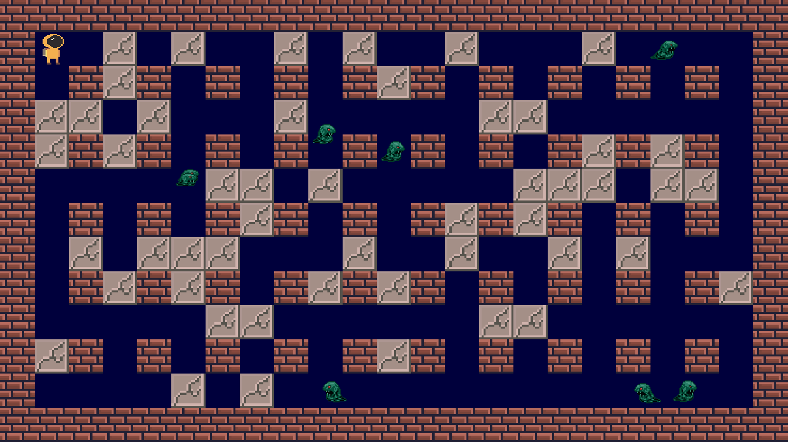
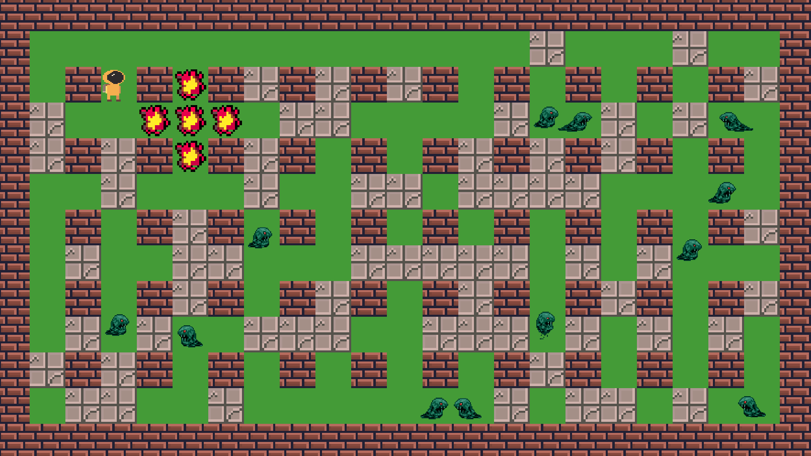
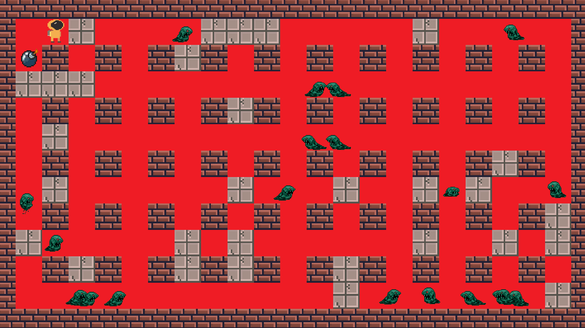

# Bomberman

## Summary
My own version of a popular old school 2D game Bomberman created with Unity engine (C#).

## Installation
If you want look inside of this project, you need to have **[Unity](https://unity.com/)** installed. If you have that, clone this repository to your computer and in Unity Hub select ``ADD`` and choose the folder ``Bomberman`` (this might vary depending on version). Then just open the created Bomberman project. If you want to play, select ``Menu`` scene and click the play button in Unity Editor.

**If you don't have Unity but still want to play, you can play in your browser [here](https://connect.unity.com/mg/other/bomberman-2).**

## Examples
Each level is always created a bit differently thanks to the random spawns. For example, number of destructible tiles, number of enemies and the speed of enemies can be changed easily in the Unity Editor making creating and adjusting new levels easier.

##

  

  

  

## Documentation
More specific comments about functions and stuff can be found directly in scripts. Here's some basic information about each script.

### ``Bomb.cs``
Controls the object bomb.

### ``BombSpawner.cs``
Places bombs into the scene.

### ``EnemyAI.cs``
Controls enemy movement and logic.

### ``Explosion.cs``
Controls the object explosion.

### ``GameMenu.cs``
Appears when player dies.

### ``Gate.cs``
Controls the gate object where player has to go.

### ``LevelCreator.cs``
Randomly spawns objects to make levels not look the same every time.

### ``MainMenu.cs``
Main menu control.

### ``MapDestroyer.cs``
Destroys destructible tiles and spawns explosion objects.

### ``PlayerMovement.cs``
Controls player movement and animation.
